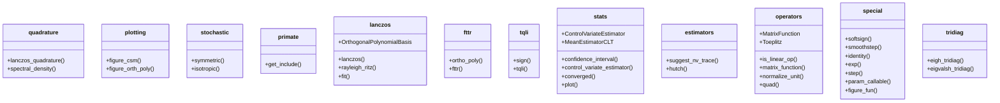

```mermaid
classDiagram
class quadrature {
    +lanczos_quadrature()
    +spectral_density()
}
class plotting {
    +figure_csm()
    +figure_orth_poly()
}
class stochastic {
    +symmetric()
    +isotropic()
}
class primate {
    +get_include()
}
class lanczos {
    +lanczos()
    +rayleigh_ritz()
    +fit()
    +OrthogonalPolynomialBasis
}
class fttr {
    +ortho_poly()
    +fttr()
}
class tqli {
    +sign()
    +tqli()
}
class stats {
    +confidence_interval()
    +control_variate_estimator()
    +converged()
    +plot()
    +ControlVariateEstimator
    +MeanEstimatorCLT
}
class estimators {
    +suggest_nv_trace()
    +hutch()
}
class operators {
    +is_linear_op()
    +matrix_function()
    +normalize_unit()
    +quad()
    +MatrixFunction
    +Toeplitz
}
class special {
    +softsign()
    +smoothstep()
    +identity()
    +exp()
    +step()
    +param_callable()
    +figure_fun()
}
class tridiag {
    +eigh_tridiag()
    +eigvalsh_tridiag()
}
```